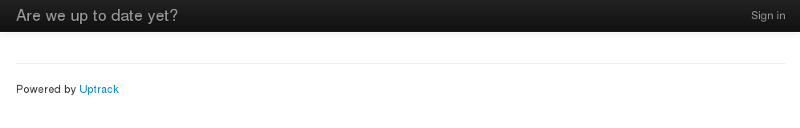
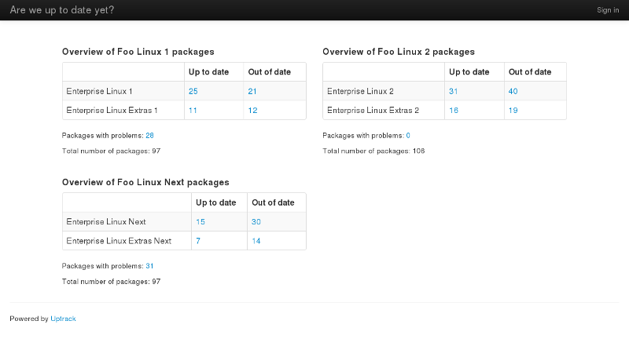
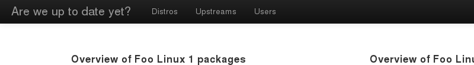
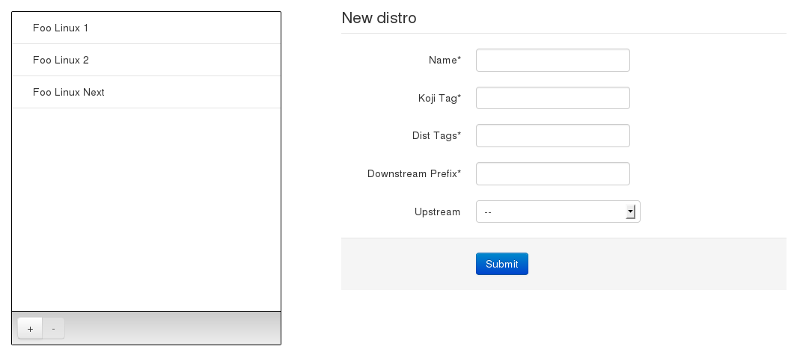
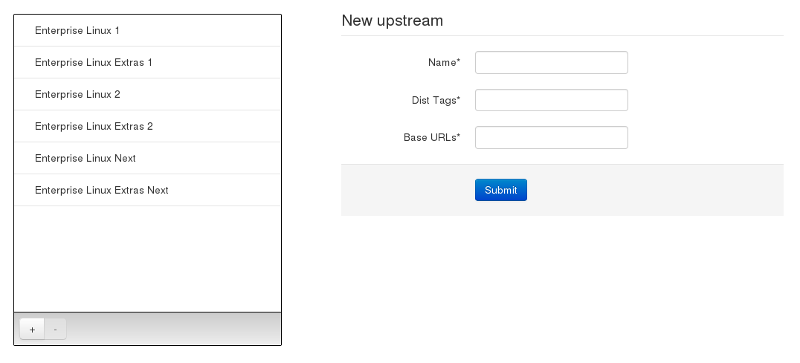
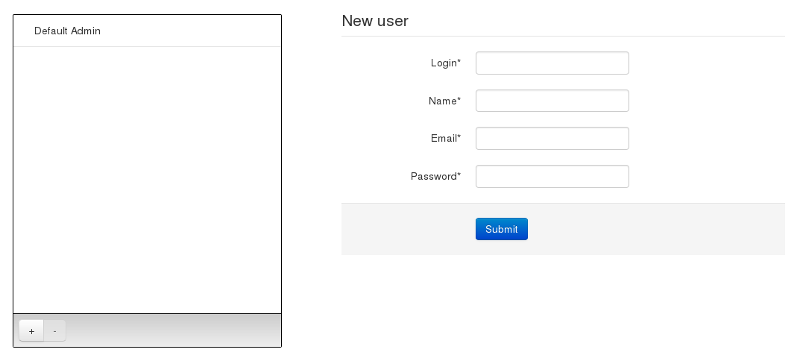

.. _usage:

*************
Using Uptrack
*************

The first time you run Uptrack, the home page may disappoint you.

Indeed, this is what you will see:

   Uptrack's empty home page

You'll need to log in and start managing the application before it gets really
interesting.

But don't worry, the rest of this documentation will help you do just that.

.. _concepts:

General concepts
================

There are three fundamental concepts in Uptrack: **distributions**,
**upstreams** and **packages**.

Let's take an example to illustrate these...

Say you run *Foo Linux*, a community project to provide a free rebuild of a
well-known, but pricy, *Enterprise Linux*.

Your community has released 2 versions already, *Foo Linux 1* and
*Foo Linux 2*, and you are working on the thrid one, called *Foo Linux Next*
until the official release.

Each of your distributions, or "distro", is based on the corresponding
upstream versions: *Foo Linux 1* is based on *Enterprise Linux 1*, etc.

In addition, you add more packages to each version of *Foo Linux*, coming from
the corresponding *Entreprise Linux Extras* repository.

So, in Uptrack, the **distribution** called *Foo Linux 1* will have 2
**upstreams**: *Enterprise Linux 1* and *Enterprise Linux Extras 1*. Ditto for
your other distributions.

Now, for each **package** in a given **distribution**, Uptrack will compare
the latest version you have published with its last version in the appropriate
**upstream**.

And that is how it generates an overview of how up to date your distributions
are.

.. _overview:

The overview
============

Above is a screenshot of the main page of Uptrack, called the **overview**.

It lets you see at a quick glance how up to date the packages in your
distributions are, compared to their respective upstreams.

In the example above, one can see 3 "sections", one for each distribution. But
let's examine one more closely.

The table of freshness
----------------------

The first thing we see is a table.

On each line is an upstream, from which we take packages. Say we are looking
at the section of the overview related to *Foo Linux 1* in the above example.
As we can see, this distribution has packages coming from 2 upstreams:
*Enterprise Linux 1* and *Enterprise Linux Extras 1*.

Each line has 2 columns. The first displays the number of packages from that
upstream which are up to date in our distribution, while the second is for the
packages from that upstream which are out of date in our distribution.

For example, 21 packages coming from *Enterprise Linux 1* are out of date in
*Foo Linux 1*. Seems like the packager need to make a few builds to catch up
then!

Problematic packages
--------------------

Under the table is a line for the number of packages in this distribution
which Uptrack considered "problematic".

These can be in a number of situation:

1. Uptrack could not determine the upstream for the package
2. Uptrack could not find the upstream version for the package
3. The version of the package you published is newer than the upstream version
4. It's a bug, please :ref:`report it <report-bugs>` :-)

In some of the above cases, it could be that there is in fact no problem. For
example, it could be that you made a conscious decision to upgrade a package
before the new version was released by your upstream (case 3 above).

Uptrack has no way of knowing though, and as a result it will keep reminding
you that this package is not in a "normal" situation (i.e coming from a known
upstream package).

Details
-------

Did you observe that each number presented on the overview is clickable?

They will take you to the list of corresponding packages.

For example, in the above example, you could view the list of out of date
packages coming from *Enterprise Linux 2* in *Foo Linux 2* by clicking on the
number **40**.

And then get to work, those 40 packages won't become up to date on their own!

Administration
==============

All administration tasks require you to log in first.

Once you do, the top bar will change, revealing the administration pages:

Each one of them will be described in the next sections, but first, you need a
way to login the first time you run Uptrack...

The default admin user
----------------------

By default the initialization script has created an administrator user, to let
you log in and manage the application.

* Login: ``admin``
* Password: ``admin``

It is probably a good idea to :ref:`create new admin users <manage-users>`
immediately, and delete this default account.

.. _manage-distros:

Managing distributions
----------------------

Distributions are :ref:`one of the central concepts in Uptrack <concepts>`. In
fact, they are what you will be most interested in, as they represent the
products you have released.

The distribution administration area looks like this:

The list on the left contains known distributions, while the form on the right
allows declaring new ones.

Click on a distribution from the list, and the form changes, letting you edit
that distribution.

The ``[+]`` button below the list will change the form back into a creation
one, and the ``[-]`` button will delete the selected distribution.

Now let's look in detail at the fields.

First is the **name** of the distribution, which will be used to represent it
visually in all user-visible strings.

The **koji tag** is the stable tag for your distribution. That is, all packages
which have reached the stable repo are tagged with it in Koji.

The **dist tags** are a comma-separated list of values used for the packages
``%{dist}`` in this distribution. For example, in *Foo Linux 2*, the normal
``%{dist}`` is ``.fl2``. However, there might still be some packages which
were built during the *Foo Linux 1* cycle, and as such have their ``%{dist}``
set to ``.fl1``. In such a case, you would use ``.fl1,.fl2``.

The **downstream prefix** is a naming convention used to represent the changes
you had to make to the package.

For example, let's say that *Foo Linux 1* has a package called ``bar``, coming
from *Enterprise Linux 1*, respectively as ``bar-2.0-1.fl1.foo2`` and
``bar-2.0-1.el1``.

For some reason, the *Foo Linux* community needed to make 2 changes to the
upstream package, which they indicated with that ``.foo2`` after the
``%{dist}`` portion of the package NVR.

This is a convention that they use to denote their downstream changes, and so
their **downstream prefix** is ``.foo``.

Finally, the last field is to indicate the **upstream** for this distribution.
This is optional, for two reasons:

1. you need to have :ref:`created some upstreams <manage-upstreams>` before
   you can set this
2. some distributions have more than one upstream. As such, the upstream will
   be determined per package, and this field should be left blank.

Once you're happy with your distribution, hit the **submit** button, and move
on to declaring your upstreams.

.. _manage-upstreams:

Managing upstreams
------------------

Upstreams are the second :ref:`central concept <concepts>` in Uptrack. They
represent the upstream distributions from which your packages are coming.

The upstream administration area looks like this:

It looks and behave very similarly to the already detailed
:ref:`distribution management interface <manage-distros>`, so we won't detail
each component of the UI again, only the various fields and their meanings.

First is the **name** of the upstream, which will be used to represent it
visually in all user-visible strings.

The **dist tags** field has the same meaning it had for
:ref:`distributions <manage-distros>` : it is what packages published by this
upstream use as their ``%{dist}``.

Finally, the **base URLs** are a comma-separated list of the Yum repositories
for this upstream. This is how Uptrack will check the versions of each
packages published by this upstream.

If you're happy with your upstreams, now is the time to
:ref:`finally check the freshness of those packages <sync-data>`.

.. _manage-users:

Managing administrators
-----------------------

All the management tasks in Uptrack require administrators to log in.

Contrarily to most applications, Uptrack doesn't have a complex system of
permissions, groups and ACLs. Users are either logged in (in which case they
are considered administrators) or viewing the pages anonymously.

The reasoning behind this is that you are either a user of the distributions
tracked by Uptrack who wants to know how good his favourite distribution is
doing, or a trusted member of the community who wants to declare the latest
release, or a new upstream.

Given that, and the fact that management is fairly rare in Uptrack, there
really is no need for complex hierarchical structures and authorization
systems.

That is also why there is no way to register for a new account: if you are a
trusted contributor, ask an admin to create your account.

With that said, here is what the user management interface looks like:

It looks and behave very similarly to the already detailed
:ref:`distribution management interface <manage-distros>`, so we won't detail
each component of the UI again, only the various fields and their meanings.

First is the **login** of the user, which she will use... that's right, to
log in.

Next is the user's **name**, used to represent the user visually in all
user-visible strings. At the moment, it is only used in the list on the left
part of the user management interface.

The next field is the user's **email**, which is currently completely unused.
Eventually, users might be able to subscribe to notifications concerning the
status of each distribution, or something like that.

The last field is the user's **password**, which is self-explanatory.

.. _sync-data:

Data synchronization
====================

.. note:: Before running this, you must have properly configured your
   :ref:`distributions <manage-distros>` and
   :ref:`upstreams <manage-upstreams>`.

This is where you finally populate the database with all the information about
the state of your packages, and how up to date they compared to your
upstreams.

The process is very simple, although a bit long.

All you have to do is run the following command, from your active
:ref:`virtual environment <virtualenv>`::

    $ uptrack-sync development.ini

Depending on the number of distributions and upstreams you have declared, it
might take a while.

Once finished, though, it will generate that
:ref:`beautiful overview <overview>` you will come to love:

Eventually, you might want to run the ``uptrack-sync`` command as a systemd
timer unit, or if you're into grave-digging, as a cron script.
